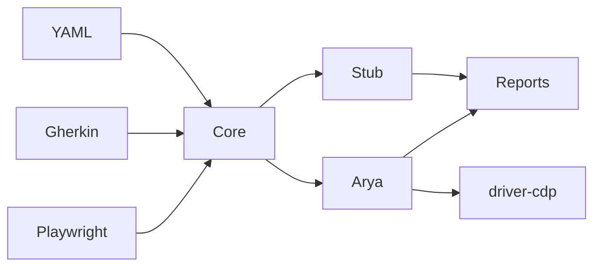

# arya-guard-cdp-tests (Arya QA Framework v2)

Public, installable **CDP QA framework** for [Arya 900 Guard](https://github.com/andreibujaki/arya900) / Guard Lab — and a **generic core** you can repurpose for other Electron apps.

- **YAML + Gherkin** authoring (one `CaseDefinition` model); Playwright optional for TS specs
- **Zero hard npm dependencies** (Node 20+ only); `@playwright/test` is optional
- **Named oracles & invariants**, tags, severity, hooks, capability skips
- **Chaos profiles**, **goldens**, quarantine, differential mode
- **Reports:** Markdown, JSON (schema-versioned), JUnit, Allure-style results, GitHub Job Summary
- **Adapters:** `stub` (CI), `arya` (live), `example-echo` (template)
- Ships **public sample fixtures only** (`fixtures/sample-project`)

## Install

```bash
git clone https://github.com/andreibujaki/arya-guard-cdp-tests.git
cd arya-guard-cdp-tests
npm install
npm run check
```

No private documents required. Optional: `cp config.example.json config.local.json`.

## Quick start (no Guard — CI / local stub)

```bash
npm run test:stub          # smoke suite on stub adapter
npm run test:echo          # example-echo adapter
npm run test:unit          # oracle/chaos/golden unit tests
```

## Live Arya Guard

```bat
"C:\Program Files\Arya 900 Guard\Arya 900 Guard.exe" --remote-debugging-port=9222
```

```bash
npm run probe
npm run preflight -- --project arya
npm run setup:folder
# set ARYA_MODEL_PATH then:
npm run setup:model
npm run test:prod          # T1–T9
npm run test:route         # R1–R4
npm run test:lab           # both
```

Lab CDP port: `$env:ARYA_CDP_PORT=9223`.

## Architecture

| Package | Role |
| --- | --- |
| `@arya-qa/core` | Case engine, loaders, oracles, invariants, chaos, goldens, reports |
| `@arya-qa/driver-cdp` | Generic Electron CDP |
| `@arya-qa/driver-stub` | Fake captures for CI |
| `@arya-qa/adapter-arya` | Arya llmRpc + fresh-turn + write/deny/abort |
| `@arya-qa/adapter-example-echo` | Repurpose demo |
| `@arya-qa/cli` | `arya-cdp-test` CLI |



## Authoring tests

1. **YAML** — `suites/yaml/*.yaml` + entry in `suites/catalog.yaml`
2. **Gherkin** — `features/*.feature` (see `route-gate-bdd` suite)
3. **Playwright TS** — `tests/*.spec.ts` (calls CLI or imports core)

```yaml
- id: R1-opt-out
  prompt: "do not search in documents, tell whats the Hodge Conjecture?"
  tags: [route]
  requires: [cdp, modelLoaded]
  expect:
    - oracle: noKnowledgeTools
    - oracle: replyMinLength
      min: 40
  invariants: [ifOptOutNoKnowledgeTools]
```

Oracle list: `node packages/cli/src/cli.mjs --list-oracles`  
Docs: [docs/oracle-catalog.md](docs/oracle-catalog.md), [docs/write-an-adapter.md](docs/write-an-adapter.md), [docs/chaos-and-goldens.md](docs/chaos-and-goldens.md).

## Chaos & goldens

```bash
node packages/cli/src/cli.mjs --project stub --suite smoke --chaos --chaos-profile light
node packages/cli/src/cli.mjs --project stub --suite smoke --update-goldens
node packages/cli/src/cli.mjs --project stub --suite smoke --differential --chaos
```

Live Arya: chaos stays **off** unless `--chaos` or `CHAOS=1`.

## Reports

Each run writes under `sessions/…`:

- `REPORT.md` / `REPORT.json`
- `junit.xml`
- `allure-results/`
- `job-summary.md`
- `cdp-point-captures/`

## CLI flags

`--list` `--list-oracles` `--probe` `--preflight` `--setup folder|model`  
`--project stub|arya|example-echo` `--suite <id>` `--tags a,b`  
`--chaos` `--chaos-profile` `--strict` `--strict-soft` `--update-goldens` `--differential`  
`--from T3` `--turn "…"`

Env: `ARYA_CDP_PORT` `ARYA_FOLDER` `ARYA_MODEL_PATH` `ARYA_SESSION` `ARYA_FROM` `ARYA_WAIT_MS` `CHAOS`.

## Exit codes

| Code | Meaning |
| --- | --- |
| 0 | Pass (quarantine ignored unless `--strict`) |
| 1 | Setup / infra error |
| 2 | Case failures |

## Design spec

[docs/superpowers/specs/2026-10-07-arya-qa-framework-design.md](docs/superpowers/specs/2026-10-07-arya-qa-framework-design.md)

## License

Apache-2.0
