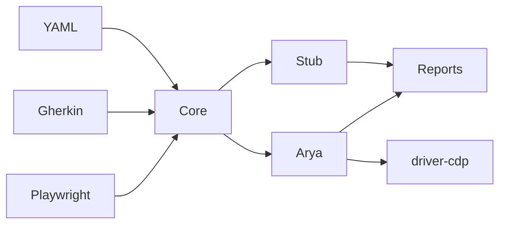

# Arya900 QA framework tests

Public, installable **CDP QA framework** for agent and AI-engine testing of [Arya 900 Guard](https://github.com/andreibujaki/arya900) / Guard Lab — and a **generic core** you can repurpose for other Electron apps.

- **YAML + Gherkin** authoring (one `CaseDefinition` model); Playwright optional for TS specs
- **Zero hard npm dependencies** (Node 20+ only); `@playwright/test` is optional
- **Named oracles & invariants**, tags, severity, hooks, capability skips
- **Chaos profiles**, **goldens**, quarantine, differential mode
- **Reports:** Markdown, JSON (schema-versioned), JUnit, Allure-style results, GitHub Job Summary
- **Adapters:** `stub` (CI), `arya` (live), `example-echo` (template)
- Ships **public sample fixtures only** (`fixtures/sample-project`)

---

## Project scope: agent and AI engine testing

This repository is a **quality-assurance harness for local AI assistants that use tools and agents** — specifically Arya 900 Guard’s chat + Knowledge/Project agent stack. It does **not** train models, score academic benchmarks (MMLU, TruthfulQA, etc.), or replace unit tests inside the Guard app. It answers a different question:

> When a real user types a prompt into the running desktop app, does the **AI engine + agent + tools** behave correctly, safely, and observably?

### What “AI engine” means here

In Arya Guard, a turn is more than “call an LLM.” The **engine path** for one user message typically includes:

1. **Routing / intent** — decide plain chat vs Knowledge agent vs clarify vs write short-circuit  
2. **Skills** — pick `knowledge-search`, `knowledge-compare`, office skills, etc.  
3. **Tools** — `search_knowledge_base`, `read_text_file`, `list_folder`, `knowledge_write`, …  
4. **Confirm UI** — Allow / Deny on sensitive tools  
5. **Grounding** — answers that must come from Project files, not free invention  
6. **Abort / stop** — user can cancel mid-generation  

The framework drives that full path through the **real UI and RPC** (Chrome DevTools Protocol), then judges **observable outcomes**: Activity panel tool lines, model reply text, files on disk, route-band debug lines, confirm clicks.

### What “agent testing” means here

An **agent** turn is one where the model is allowed (or forced) to call tools in a loop under skills / step limits. Agent QA in this project focuses on:

| Concern | Examples of what we assert |
| --- | --- |
| **Activation** | Fuzzy filename read starts a skill/agent; inventory uses list tools |
| **Tool use** | Compare reads **two** files; search hits the Project; write tools fire |
| **Non-activation** | “Do not search in documents…” stays in plain chat (no Knowledge tools) |
| **Routing bands** | Ambiguous analyze → mid-band clarify, **no** tools until the user chooses |
| **Safety UX** | Write + Deny → file **absent**; long turn + Stop → input re-enabled |
| **Integrity** | Sample fixture hashes unchanged (no silent corruption of golden docs) |
| **Grounding signals** | Reply mentions demo tokens / file names from the Project, not unrelated hallucination markers |

Suites map to those concerns:

- **`route-gate` (R1–R4)** — routing confidence: opt-out, general fact, inventory, mid clarify  
- **`prod` (T1–T9)** — agent/tool production pack: fuzzy read, compare, search, csv/text analyze, write allow/deny, abort, fixture integrity  
- **`lab`** — route-gate + prod (promotion-style pack for Guard Lab)  
- **`smoke` / `echo`** — stub adapters for CI without a live model  

### Quality dimensions covered

1. **Functional correctness of the agent stack** — right tools, right files, right short-circuits  
2. **Policy / routing** — when tools must **not** run (opt-out, low route, mid clarify)  
3. **Human-in-the-loop** — confirm Allow/Deny and Stop behave as product rules  
4. **Deterministic fixtures** — public `fixtures/sample-project` so anyone can reproduce  
5. **Robustness (optional)** — chaos (deny/abort/delay), goldens (Activity fingerprints), quarantine for flaky/chaos fails  
6. **Repurposability** — swap adapters so the same case model can test another Electron AI app’s engine  

### How a live agent test runs (mechanically)

```text
CLI / suite YAML
    → adapter-arya connects to Guard CDP (:9222 / :9223)
    → RPC newChat + (optional) settings (folder, confirm policy)
    → mouse/keyboard types the user prompt and clicks Send
    → waits until generation finishes (or short-circuit reply stabilizes)
    → auto-clicks Allow if a confirm dialog appears (except Deny cases)
    → expands Activity, snapshots lastModel + activityItems
    → named oracles + invariants → PASS / FAIL / SKIP / QUARANTINE
    → REPORT.md + JSON + JUnit + captures
```

Oracles prefer **signals** (tool names, route band, file existence) over “does the prose sound smart?” — because LLM wording varies; **engine behavior** should not.

### In scope

- End-to-end **interactive** tests against a running Arya Guard / Guard Lab window  
- Knowledge/Project **agent and tool** behavior (search, read, list, compare, write, deny, abort)  
- **Route-confidence** gate behavior (high → agent, mid → clarify, low → plain chat)  
- Stub/CI mode that **simulates** captures so loaders, oracles, reports, and adapters can be tested without GPU/model  
- Authoring surfaces for agent scenarios: YAML, Gherkin, optional Playwright  
- Reports suitable for humans and CI gates  

### Out of scope (intentionally)

- **Model quality benchmarks** (accuracy leaderboards, TruthfulQA, MMLU, BLEU, etc.)  
- **Training / fine-tuning / LoRA** evaluation  
- **Token-level or logit** inspection of `node-llama-cpp`  
- Replacing Guard’s **in-repo unit tests** (intent classifiers, search ranking, etc. — those stay in the app repo)  
- Launching Guard, downloading GGUFs, or provisioning GPUs for you  
- Testing **private customer documents** (do not commit them; point `ARYA_FOLDER` at your own folder locally)  
- Guaranteeing identical natural-language wording across model versions  

### Relationship to the Arya product

| Layer | Where it lives | Role |
| --- | --- | --- |
| AI runtime (GGUF load, generate, tools schema) | Arya 900 Guard app | Engine under test |
| Agent skills / Knowledge routing | Guard (+ Guard Lab builds) | Behavior under test |
| **This repo** | External harness | Observes and judges the running engine/agent |

Use **Guard Lab** (`:9223`) to validate experimental gates (e.g. route-confidence) before promoting the same behavior into production Guard.

### Success criteria for “agent/engine OK”

A pack is considered healthy when:

- Required agent cases **activate tools/skills** when they should, and **do not** when policy says not to  
- Grounded cases show Project-linked content (tokens/filenames), not empty or tool-free wrong paths  
- Write deny / abort cases enforce safety UX  
- Stub CI stays green so harness regressions are caught without a live model  
- Reports make failures **traceable** (case id → capture → oracle notes)  

---

## Install

```bash
git clone https://github.com/andreibujaki/arya900-qa-framework-tests.git
cd arya900-qa-framework-tests
npm install
npm run check
```

No private documents required. Optional: `cp config.example.json config.local.json`.

## Quick start (no Guard — CI / local stub)

```bash
npm run test:stub          # smoke suite on stub adapter
npm run test:echo          # example-echo adapter
npm run test:unit          # oracle/chaos/golden unit tests
```

## Live Arya Guard

```bat
"C:\Program Files\Arya 900 Guard\Arya 900 Guard.exe" --remote-debugging-port=9222
```

```bash
npm run probe
npm run preflight -- --project arya
npm run setup:folder
# set ARYA_MODEL_PATH then:
npm run setup:model
npm run test:prod          # T1–T9
npm run test:route         # R1–R4
npm run test:lab           # both
```

Lab CDP port: `$env:ARYA_CDP_PORT=9223`.

## Architecture

| Package | Role |
| --- | --- |
| `@arya-qa/core` | Case engine, loaders, oracles, invariants, chaos, goldens, reports |
| `@arya-qa/driver-cdp` | Generic Electron CDP |
| `@arya-qa/driver-stub` | Fake captures for CI |
| `@arya-qa/adapter-arya` | Arya llmRpc + fresh-turn + write/deny/abort |
| `@arya-qa/adapter-example-echo` | Repurpose demo |
| `@arya-qa/cli` | `arya-cdp-test` CLI |



## Authoring tests

1. **YAML** — `suites/yaml/*.yaml` + entry in `suites/catalog.yaml`
2. **Gherkin** — `features/*.feature` (see `route-gate-bdd` suite)
3. **Playwright TS** — `tests/*.spec.ts` (calls CLI or imports core)

```yaml
- id: R1-opt-out
  prompt: "do not search in documents, tell whats the Hodge Conjecture?"
  tags: [route]
  requires: [cdp, modelLoaded]
  expect:
    - oracle: noKnowledgeTools
    - oracle: replyMinLength
      min: 40
  invariants: [ifOptOutNoKnowledgeTools]
```

Oracle list: `node packages/cli/src/cli.mjs --list-oracles`  
Docs: [docs/oracle-catalog.md](docs/oracle-catalog.md), [docs/write-an-adapter.md](docs/write-an-adapter.md), [docs/chaos-and-goldens.md](docs/chaos-and-goldens.md).

## Chaos & goldens

```bash
node packages/cli/src/cli.mjs --project stub --suite smoke --chaos --chaos-profile light
node packages/cli/src/cli.mjs --project stub --suite smoke --update-goldens
node packages/cli/src/cli.mjs --project stub --suite smoke --differential --chaos
```

Live Arya: chaos stays **off** unless `--chaos` or `CHAOS=1`.

## Reports

Each run writes under `sessions/…`:

- `REPORT.md` / `REPORT.json`
- `junit.xml`
- `allure-results/`
- `job-summary.md`
- `cdp-point-captures/`

## CLI flags

`--list` `--list-oracles` `--probe` `--preflight` `--setup folder|model`  
`--project stub|arya|example-echo` `--suite <id>` `--tags a,b`  
`--chaos` `--chaos-profile` `--strict` `--strict-soft` `--update-goldens` `--differential`  
`--from T3` `--turn "…"`

Env: `ARYA_CDP_PORT` `ARYA_FOLDER` `ARYA_MODEL_PATH` `ARYA_SESSION` `ARYA_FROM` `ARYA_WAIT_MS` `CHAOS`.

## Exit codes

| Code | Meaning |
| --- | --- |
| 0 | Pass (quarantine ignored unless `--strict`) |
| 1 | Setup / infra error |
| 2 | Case failures |

## Customize for other projects

The harness is built so **Arya is one adapter**, not the whole product. You can point the same case engine at another Electron (or CDP) AI app, or keep Arya and only change fixtures/suites for your own Knowledge folder.

### Non–Arya 900 projects (quick guide)

For a product that is **not** Arya 900, keep the **core** (cases, oracles, reports) and replace how the harness talks to the app.

1. **Add your own adapter** — copy the template and implement two methods:

```text
extensions/adapters/_template  →  packages/adapter-myapp
```

```js
export function createMyAdapter() {
  return {
    name: "myapp",
    version: "1.0.0",
    async probeCapabilities(cfg) {
      // e.g. { cdp, modelLoaded, knowledgeFolder, confirmUi }
    },
    async runCase(ctx, caseDef) {
      // send prompt to YOUR app, wait, return TurnCapture:
      // { lastModel, activityItems, routeBand?, deniedClick?, stopped?, ... }
    }
  };
}
```

- If the app is Electron with `--remote-debugging-port=…`, reuse [`packages/driver-cdp`](packages/driver-cdp/src/index.mjs) (`connectCdp`, `clickFind`, …).
- Change selectors/RPC to **your** UI — do not require Arya’s `textarea.input` / `llmRpc`.
- For CI without the app, wrap [`driver-stub`](packages/driver-stub) like [`adapter-example-echo`](packages/adapter-example-echo).

2. **Register it in the CLI** — in [`packages/cli/src/cli.mjs`](packages/cli/src/cli.mjs) → `pickAdapter()`:

```js
if (name === "myapp") return createMyAdapter();
```

3. **Write your suites** — new YAML under `suites/yaml/…`, register in [`suites/catalog.yaml`](suites/catalog.yaml). Prompts and oracle patterns must match **your** product language and Activity/tool logs.

4. **Point at your test data (local only)**:

```bash
# PowerShell — ARYA_FOLDER is just the projectRoot env name (historical)
$env:ARYA_FOLDER="D:\path\to\your\test-docs"
node packages/cli/src/cli.mjs --project myapp --suite my-suite --preflight
node packages/cli/src/cli.mjs --project myapp --suite my-suite
```

5. **Extend checks if wording differs** — add oracles in `packages/core/src/oracles.mjs` for your tool names / log lines. Assert **engine signals** (tool fired, file exists, deny clicked), not full LLM essays.

**You do not need:** Guard install, GGUF models, or Arya-specific skills. Prefer **adapter + suites + oracles** over forking the report/chaos engine.

Step-by-step detail also under **Path B** below and [docs/write-an-adapter.md](docs/write-an-adapter.md).

### What you usually customize

| Layer | Keep | Replace / extend |
| --- | --- | --- |
| **Core** (`packages/core`) | Case model, oracles, invariants, reports, chaos/goldens | Add new named oracles/invariants for your app’s Activity wording |
| **Driver** | `driver-cdp` (generic) or `driver-stub` (CI) | Rarely needed unless your app is not CDP/Electron |
| **Adapter** | — | New `packages/adapter-<yourapp>` (how to talk to *your* UI/RPC) |
| **Fixtures** | Public sample pack as a template | Your own folder via `ARYA_FOLDER` / `projectRoot` (never commit secrets) |
| **Suites** | smoke / catalog pattern | New YAML/Gherkin cases for *your* prompts and pass rules |
| **CLI** | flags and reports | Register your adapter in `pickAdapter()` |

### Path A — Same Arya Guard, your own Project files

Use when the product is still Arya, but documents/prompts differ:

1. Put documents in any local folder (or copy `fixtures/sample-project` and edit).
2. Set folder + model against a running Guard with CDP:

```bash
# PowerShell
$env:ARYA_CDP_PORT="9222"
$env:ARYA_FOLDER="D:\path\to\your\Knowledge"
$env:ARYA_MODEL_PATH="C:\path\to\model.Q4_K_M.gguf"
npm run setup:folder
npm run setup:model
```

3. Copy a suite YAML (e.g. `suites/yaml/prod.yaml` → `suites/yaml/my-project.yaml`).
4. Change `prompt` strings and oracle `pattern`s to match **your** filenames/tokens.
5. Register it in [`suites/catalog.yaml`](suites/catalog.yaml):

```yaml
- id: my-project
  title: My Knowledge pack
  tags: [custom]
  files:
    - suites/yaml/my-project.yaml
```

6. Run:

```bash
node packages/cli/src/cli.mjs --project arya --suite my-project
```

Optional: `config.local.json` with `projectRoot`, `modelPath`, `cdpPort` (gitignored).

### Path B — Different Electron AI app (new adapter)

Use when UI/RPC is not Arya:

1. **Copy the template**

```bash
# from repo root
cp -r extensions/adapters/_template packages/adapter-myapp
# or on Windows: Copy-Item -Recurse extensions\adapters\_template packages\adapter-myapp
```

2. **Implement the adapter contract** in `packages/adapter-myapp/src/index.mjs`:

```js
export function createMyAdapter() {
  return {
    name: "myapp",
    version: "1.0.0",
    async probeCapabilities(cfg) {
      // return { cdp, modelLoaded, knowledgeFolder, confirmUi, ... }
    },
    async runCase(ctx, caseDef) {
      // drive one turn; return TurnCapture:
      // { lastModel, activityItems, routeBand?, deniedClick?, stopped?, writeName?, fileExists? }
    }
  };
}
```

3. **Reuse CDP** if the app exposes `--remote-debugging-port=…`:

   - Import helpers from [`packages/driver-cdp/src/index.mjs`](packages/driver-cdp/src/index.mjs) (`connectCdp`, `clickFind`, …).
   - Map your selectors (composer, Send, Allow/Deny, Activity list) — Arya’s are in `adapter-arya` as a reference, not a requirement.

4. **Stub for CI** — start from [`packages/adapter-example-echo`](packages/adapter-example-echo) / `driver-stub` so suites run without your app installed.

5. **Register the adapter** in [`packages/cli/src/cli.mjs`](packages/cli/src/cli.mjs) `pickAdapter()`:

```js
if (name === "myapp") return createMyAdapter();
```

6. **Add suites** that use capabilities your probe reports (`requires: [cdp, modelLoaded, …]`).

7. **Run**

```bash
node packages/cli/src/cli.mjs --project myapp --suite my-project --preflight
node packages/cli/src/cli.mjs --project myapp --suite my-project
```

More detail: [docs/write-an-adapter.md](docs/write-an-adapter.md).

### Path C — New checks without a new app

- **Oracles** — add a function to `packages/core/src/oracles.mjs`, then reference it in YAML: `expect: [{ oracle: myNewCheck }]`.
- **Invariants** — add to `packages/core/src/invariants.mjs` (property-style rules, e.g. “if low route → never search”).
- **Gherkin** — describe scenarios in `features/*.feature` and list the file in `catalog.yaml` (see `route-gate-bdd`).
- **Goldens** — pin Activity fingerprints under `goldens/`; refresh with `--update-goldens`.
- **Tags / severity** — filter with `--tags`, mark soft vs blocker, use `--strict` for quarantine.

### Customization checklist

1. App launches with CDP (or you use stub).  
2. Adapter can `newChat` / send prompt / read reply + tool/activity log.  
3. Fixture pack has only content you are allowed to publish (or stays local).  
4. Suite prompts match product language (EN/RO/…).  
5. Oracles assert **engine signals**, not fragile full LLM essays.  
6. `npm run check` (or your stub suite) stays green in CI.  
7. Live pack documented: port, folder env, model path.

### What not to fork lightly

Avoid rewriting `packages/core` report/engine unless you need a new result taxonomy. Prefer **adapter + suites + oracles**. That keeps upstream improvements (chaos, JUnit, resume) usable for every custom project.

## Design spec

[docs/superpowers/specs/2026-10-07-arya-qa-framework-design.md](docs/superpowers/specs/2026-10-07-arya-qa-framework-design.md)

## License

Apache-2.0
